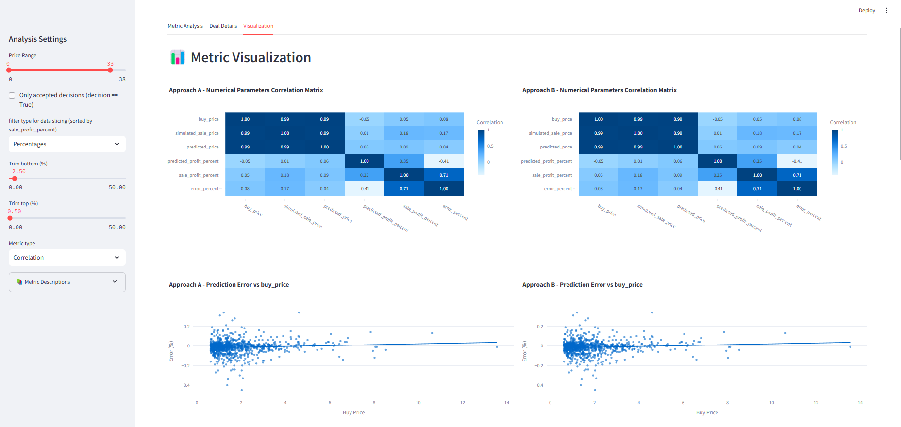

**ProfitLab**
#### [app preview](#streamlit-interface)
  

A Python project for testing and evaluating the profitability of different approaches based on time series data, with or without machine learning (ML) models.
The project consists of three main components:
- [data](#data-preparation)
- [decisions](#approaches)
- [analysis](#streamlit-interface)

If you want to test your data, feel free to explore in that order
For the test you can just run it as I have prepared the test data and approaches

**Overview**

This project provides a framework for testing and evaluating the profitability of various approaches, including those that utilize machine learning models. It includes tools for data preparation, approach configuration, and evaluation, as well as visualization and analysis of results.

**Features**

* Data preparation: Load and preprocess data for training and testing
* Approach configuration: Configure and evaluate different approaches, with or without ML models
* Evaluation: Evaluate the performance of approaches on test data
* Visualization: Visualize results using various plots and charts
* Analysis: Analyze results using various metrics and statistics

**Requirements**

* Python 3.10+
* NumPy
* Pandas
* Plotly
* Pydantic
* Streamlit
* Pipenv 

Dependencies for ML (separately in the file ml_reqs.txt):
* TensorFlow
* CatBoost

**Installation**

1. Clone the repository: `git clone https://github.com/your-username/profitability-testing-playground.git`
2. Install dependencies: `pipenv install`
3. Run the project: `streamlit run app.py`
4.  (optional) install ML dependencies: `pipenv install -r src/ml/ml_reqs.txt` is strictly for the  `data_preparation/add_predicts.ipynb ` section

**Usage**

1. Copy the template file `cfg/cfg.example.py` and rename it to `cfg/cfg.py`, then you can modify it:
   * Specify the path to your data (or use the provided test example). For details on data preparation, see the [Data Preparation](#data-preparation) section below.
   * Choose an approach (you can start with the test examples). The purpose of this module is to compare different approaches. For more details on available approaches and their configuration, see the [Approaches](#approaches) section.
2. Run the project: `streamlit run app.py`
3. Interact with the app to test and evaluate approaches. Read more in the  [Streamlit Interface](#streamlit-interface) section.

#### **Streamlit Interface**

the interface contains a sidebar and a main page:

**sidebar:**
- change price range (buy_price column)
- use only approved deals (decision == True/False)
- trim data by percentiles or by rows (sorted by sale_profit_percent column)
- select a metric (the code of each metric is in src/metrics.py)
- brief description of each metric
- 
**main page:**
- parameters and full analysis result for each approach
- tabular data of the selected metric / basic details of deals / visualization of the selected metric
- full dataset for all approaches with download option

#### **Approaches**

The key idea behind the approaches (a key component of the project) is the decision function. A function that will ultimately answer a simple question - to buy or not to buy.
*all functions inside `src/decisions/`*

* `simple_profit.py`: A simple example using a fixed minimum profit margin to buy
* `profit_and_diff_predicts.py`: Dynamically adjusts profit requirements based on the forecasting confidence and item price
* we must pass 1 predicted price (`predicted_price_attr`) and optionally a second one (`second_predicted_price_attr`) for example, to evaluate stability and visualize correlations

#### **Data Preparation**
The application works on the basis of already prepared data, in the process it only collects metrics and displays them. This is the first step to start with if you decide to test your data

The `data_preparation` directory contains notebooks:
*all notebooks are well described and structured, you can open them freely*

* `add_predicts.ipynb` adding predicted prices from ML models 
* `simulate_sale_prices.ipynb` Forming sale prices from historical sales data (if real sales data is not available)
*math formulas can be used in docstrings, to see them in vscode install 2 extensions: `Comment Formula` and `MathJax Highlight` both by `Casper Huang`*

**Contributing**

Contributions are welcome! If you'd like to contribute to the project, please fork the repository and submit a pull request.

**License**

The project is licensed under the MIT License.

**Acknowledgments**

This project and parts of it have been part of my projects for a long time, here I decided to bring it all together in one convenient place.

**Changelog**

* v1.0: Initial release

## TODO:

- [ ] Add real cases of decision making functions from prod
- [ ] release a new open source project for time series labeling and provide a link to it in the [Data Preparation ](#data-preparation) section
- [ ] Work around and add new metrics
- [ ] Add some images or gifs to simplify understanding 
- [ ] Think about how to combine the two approaches: based on real and simulated sales

**Authors**

* [dr11m](https://github.com/dr11m)

**Copyright**

Copyright (c) 2023 [dr11m]. All rights reserved.